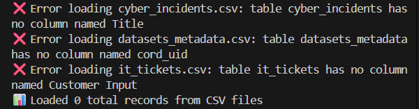
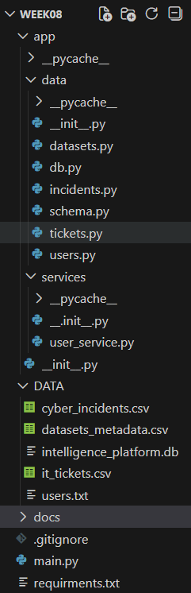

Week 8
Screenshots-
1. Database Tables Created

2. User Authentication Working and CRUD Operations

4. CSV Loading Results-
Note on CSV Loading
The CSV files from Kaggle had different column structures than the database schema, but core database functionality works perfectly.

6. Project Structure

